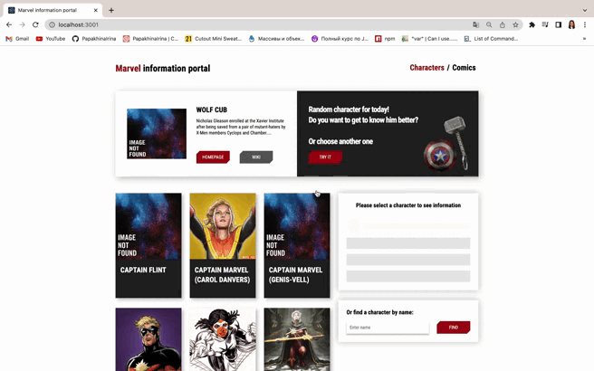
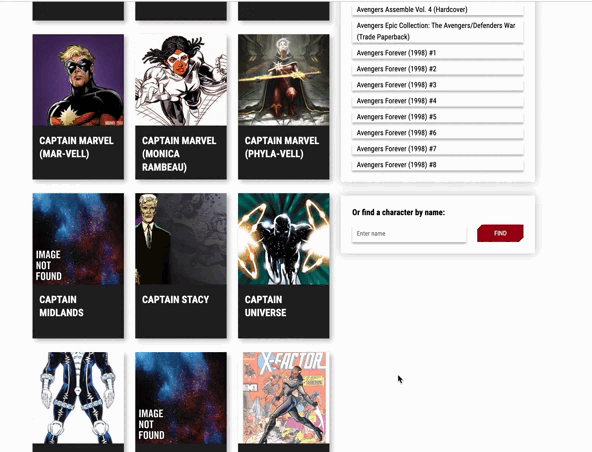
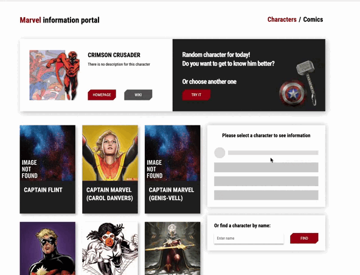

> # **Marvel** information portal :superhero_man:

>>React приложение на хуках

## Разработчик [Ирина Папахина](https://github.com/PapakhinaIrina) 
___
### Стэк: React Hooks, React Router, Yup, Formik, JS, CSS.

___
### Данное приложение основанное на [Marvel API](https://developer.marvel.com/) содержит информацию и данные по каждому персонажу Marvel, а также  комиксы. Разработанно в рамках прохождения курса Ивана Петриченко [Полный курс по JavaScript + React - с нуля до результата](https://www.udemy.com/course/javascript_full/)
___
 >Возможности приложения:

:shield: рандомный показ персонажа с кратким описанием + спиннер загрузки

___

:shield: при клике на персонажа происходит фокус иконки, она подсвечивается красным цветом

___

:shield: подгрузка новых персонажей без перезагрузки страницы 

___

:shield: поиск персонажа и переход на страницу с его описанием

___

:shield: страница с комиксами, в которую также включена возможность подгрузка новых без перезагрузуки страницы

___

:shield: стилизация активной ссылки 

___